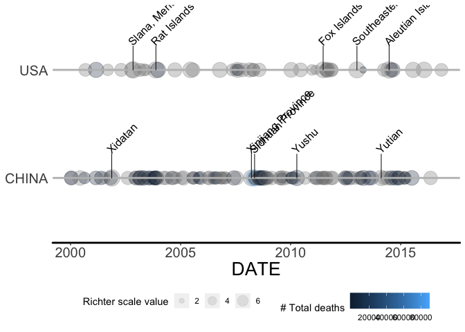
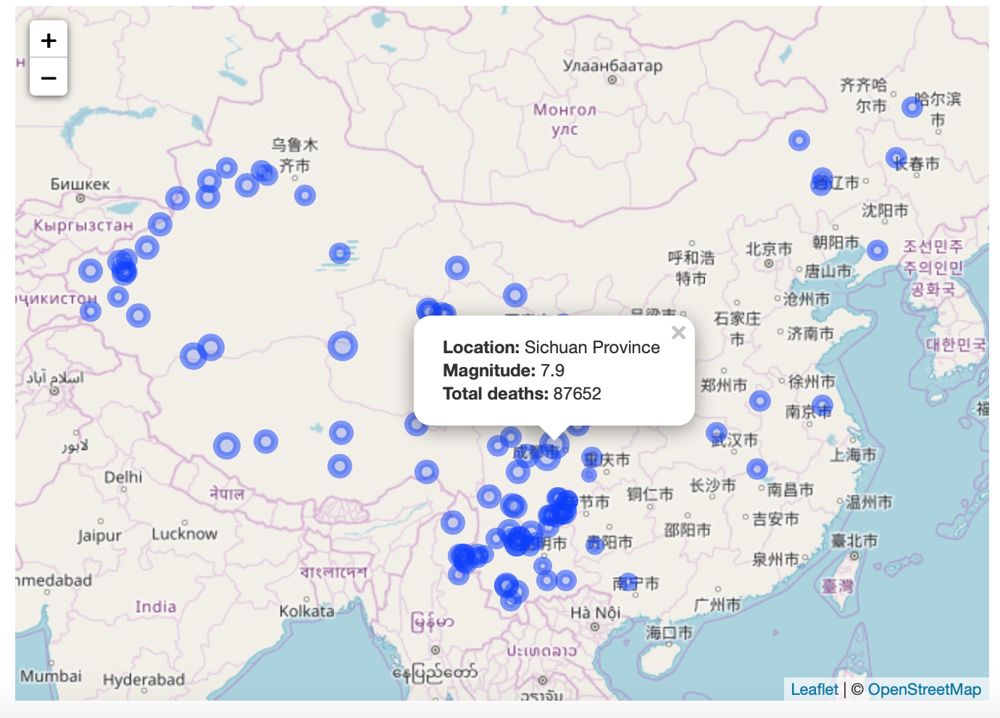

```r
library(tidyr)
library(dplyr)
library(earthquake)
library(ggplot2)
```
# Earthquake

The goal of earthquake is to facilitate exploration of NOAA Significant Earthquakes dataset

## Usage

**1. Display earthquake timeline given countries with a date inteval**


```r
dim(eq_dat_clean)
#> [1] 5954   48
dat <- dplyr::select(eq_dat_clean, DATE, COUNTRY, LOCATION_NAME, LONGITUDE, LATITUDE, 
               EQ_MAG_MS, EQ_PRIMARY, TOTAL_DEATHS) %>%
  filter(COUNTRY %in% c("USA", "CHINA"))

tl <- ggplot2::ggplot(data = dat, aes(x=DATE, 
                              size=as.numeric(EQ_PRIMARY),
                              fill=as.numeric(TOTAL_DEATHS),
                              y=COUNTRY)) +
  geom_timeline(xmin=as.Date("2000-01-01"), xmax=as.Date("2017-01-01"), stat="Timeline") +
  geom_timeline_label(aes(label = LOCATION_NAME),n_max=5, xmin=as.Date("2000-01-01"), xmax=as.Date("2017-01-01")) +
  scale_fill_gradient(name="# Total deaths") +
  scale_size_continuous(name="Richter scale value") +
  theme_timeline
tl
```

<!-- -->

**2. Diplay interactive map to explore earthquake given a country**


```r
eq_dat_clean %>% 
  dplyr::filter(COUNTRY == "CHINA" & lubridate::year(DATE) >= 2000) %>% 
  dplyr::mutate(popup_text = eq_create_label(.)) %>% 
  eq_map(annot_col = "popup_text")
```

<!-- -->
