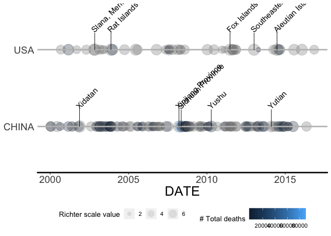

```r
library(tidyr)
library(dplyr)
#> Warning: package 'dplyr' was built under R version 3.4.4
#> 
#> Attaching package: 'dplyr'
#> The following objects are masked from 'package:stats':
#> 
#>     filter, lag
#> The following objects are masked from 'package:base':
#> 
#>     intersect, setdiff, setequal, union
library(earthquake)
library(ggplot2)
#> Warning: package 'ggplot2' was built under R version 3.4.4
```
# earthquake

The goal of earthquake is to facilitate exploration of NOAA Significant Earthquakes dataset

## Usage

1. Display earthquake timeline given countries with a date inteval


```r
dim(eq_dat_clean)
#> [1] 5954   48
dat <- dplyr::select(eq_dat_clean, DATE, COUNTRY, LOCATION_NAME, LONGITUDE, LATITUDE, 
               EQ_MAG_MS, EQ_PRIMARY, TOTAL_DEATHS) %>%
  filter(COUNTRY %in% c("USA", "CHINA"))
#> Warning: package 'bindrcpp' was built under R version 3.4.4


tl <- ggplot2::ggplot(data = dat, aes(x=DATE, 
                              size=as.numeric(EQ_PRIMARY),
                              fill=as.numeric(TOTAL_DEATHS),
                              y=COUNTRY)) +
  geom_timeline(xmin=as.Date("2000-01-01"), xmax=as.Date("2017-01-01"), stat="Timeline") +
  geom_timeline_label(aes(label = LOCATION_NAME),n_max=5, xmin=as.Date("2000-01-01"), xmax=as.Date("2017-01-01")) +
  scale_fill_gradient(name="# Total deaths") +
  scale_size_continuous(name="Richter scale value") +
  theme_timeline
#> Warning in strptime(xx, f <- "%Y-%m-%d", tz = "GMT"): unknown timezone
#> 'zone/tz/2018i.1.0/zoneinfo/America/New_York'


tl
```

<!-- -->

2. Diplay interactive map to explore earthquake given a country


```r
eq_dat_clean %>% 
  dplyr::filter(COUNTRY == "CHINA" & lubridate::year(DATE) >= 2000) %>% 
  dplyr::mutate(popup_text = eq_create_label(.)) %>% 
  eq_map(annot_col = "popup_text")
```

<!--html_preserve--><div id="htmlwidget-e0dbe2ff87f1742681a8" style="width:672px;height:480px;" class="leaflet html-widget"></div>
<script type="application/json" data-for="htmlwidget-e0dbe2ff87f1742681a8">{"x":{"options":{"crs":{"crsClass":"L.CRS.EPSG3857","code":null,"proj4def":null,"projectedBounds":null,"options":{}}},"calls":[{"method":"addProviderTiles","args":["OpenStreetMap.Mapnik",null,null,{"errorTileUrl":"","noWrap":false,"detectRetina":false}]},{"method":"addCircleMarkers","args":[[40.498,25.607,26.856,25.826,29.513,27.689,24.455,26.316,35.946,30.916,39.736,39.57,43.897,39.61,39.483,37.529,39.43,25.975,43.77,29.573,25.954,38.4,34.712,27.372,27.283,42.905,45.382,37.506,27.266,34.682,25.073,22.526,41.728,46.827,26.569,23.627,23.604,29.695,44.624,31.607,33.068,27.995,28.012,31.56,43.469,44.229,37.021,33.259,23.028,42.913,35.49,31.002,32.57,32.71,32.747,32.036,32.756,25.051,25.044,30.901,26.272,29.807,37.565,32.518,23.97,40.657,25.632,31.158,29.358,37.696,25.962,25.558,30.268,25.523,33.165,27.197,24.693,24.719,31.373,43.015,25.075,32.447,24.932,39.955,43.648,38.31,27.767,43.433,32.978,27.575,40.411,27.226,25.98,40.119,30.308,34.512,28.229,35.922,28.155,24.976,27.245,28.182,23.386,30.343,23.336,23.663,44.107,33.179,37.468,32.038,37.659],[122.994,101.063,97.238,102.194,101.129,101.003,102.66,100.648,90.541,99.927,97.443,75.254,85.923,77.23,77.393,96.476,77.219,101.29,119.643,95.605,101.254,100.951,103.834,103.971,103.753,80.515,118.256,96.758,103.873,103.781,99.169,100.709,79.44,125.058,103.036,104.103,107.798,115.689,124.122,90.413,104.95,104.138,104.151,113.21,119.558,83.524,103.911,104.74,101.052,82.378,81.467,103.322,105.424,105.54,105.542,104.722,105.494,97.919,97.684,83.52,101.937,90.35,95.833,105.395,97.569,78.692,101.095,85.902,105.438,95.718,100.825,105.804,105.668,101.903,96.548,103.005,97.943,97.969,100.757,88.247,98.721,95.948,98.73,77.028,82.437,76.888,100.781,84.7,119.593,103.983,90.355,103.071,99.812,77.466,102.888,104.262,99.37,82.549,103.641,97.865,103.427,103.57,100.487,101.72,100.474,102.907,85.641,115.798,78.136,94.987,75.253],[5.1,5.9,6.3,4.2,5.6,5.5,4.3,5.6,7.8,5.3,5.5,5.7,5.3,6.3,5.4,6.4,5.8,5.9,5.4,5.5,5.6,5.8,5.1,5.6,4.7,6,5.4,5.4,5.4,5.2,4.4,4.8,6.1,4.7,4.8,4.5,4.2,5.2,4.9,5.7,4.5,4.9,4.6,4.5,4.7,4.7,4.5,4.7,6.1,5.6,7.2,7.9,6,5.7,5.6,5.7,6,5,6,6.7,5.9,6.3,6.3,4.5,4.8,5.5,5.7,5.8,3.4,6.2,4.9,4.4,4.7,4.8,6.9,4.9,4.8,5.5,5.1,5.3,5.3,5.3,5,5.7,5.6,5.3,5.5,6.3,4.9,5.6,5.1,4.9,5.4,5.1,6.6,6,5.8,6.9,5.4,5.9,6.1,5.1,6,5.9,5.6,4.6,5.2,4.7,6.4,5.5,5.4],null,null,{"interactive":true,"className":"","stroke":true,"color":"#03F","weight":5,"opacity":0.5,"fill":true,"fillColor":"#03F","fillOpacity":0.2},null,null,[" <b>Location:<\/b> Liaoning Province <br /> <b>Magnitude:<\/b> 5.1 <br />"," <b>Location:<\/b> Yaoan County <br /> <b>Magnitude:<\/b> 5.9 <br /> <b>Total deaths:<\/b> 7 <br />"," <b>Location:<\/b> Liuku; Myanmar <br /> <b>Magnitude:<\/b> 6.3 <br />"," <b>Location:<\/b> Wuding <br /> <b>Magnitude:<\/b> 4.2 <br /> <b>Total deaths:<\/b> 1 <br />"," <b>Location:<\/b> Kangding, Yajiang <br /> <b>Magnitude:<\/b> 5.6 <br /> <b>Total deaths:<\/b> 3 <br />"," <b>Location:<\/b> Yanyuan <br /> <b>Magnitude:<\/b> 5.5 <br /> <b>Total deaths:<\/b> 2 <br />"," <b>Location:<\/b> Jiangchuan <br /> <b>Magnitude:<\/b> 4.3 <br />"," <b>Location:<\/b> Yongsheng <br /> <b>Magnitude:<\/b> 5.6 <br /> <b>Total deaths:<\/b> 1 <br />"," <b>Location:<\/b> Xidatan <br /> <b>Magnitude:<\/b> 7.8 <br />"," <b>Location:<\/b> Rulong <br /> <b>Magnitude:<\/b> 5.3 <br />"," <b>Location:<\/b> Yumne <br /> <b>Magnitude:<\/b> 5.5 <br /> <b>Total deaths:<\/b> 2 <br />"," <b>Location:<\/b> Wuqia <br /> <b>Magnitude:<\/b> 5.7 <br />"," <b>Location:<\/b> Urumqi <br /> <b>Magnitude:<\/b> 5.3 <br />"," <b>Location:<\/b> Bachu <br /> <b>Magnitude:<\/b> 6.3 <br /> <b>Total deaths:<\/b> 261 <br />"," <b>Location:<\/b> Bachu <br /> <b>Magnitude:<\/b> 5.4 <br /> <b>Total deaths:<\/b> 5 <br />"," <b>Location:<\/b> Delingha <br /> <b>Magnitude:<\/b> 6.4 <br />"," <b>Location:<\/b> Yopurga <br /> <b>Magnitude:<\/b> 5.8 <br /> <b>Total deaths:<\/b> 1 <br />"," <b>Location:<\/b> Yunnan Province <br /> <b>Magnitude:<\/b> 5.9 <br /> <b>Total deaths:<\/b> 16 <br />"," <b>Location:<\/b> Lindong, Tianshan <br /> <b>Magnitude:<\/b> 5.4 <br /> <b>Total deaths:<\/b> 4 <br />"," <b>Location:<\/b> Bomi,Medog,Nyingchi <br /> <b>Magnitude:<\/b> 5.5 <br />"," <b>Location:<\/b> Dayao <br /> <b>Magnitude:<\/b> 5.6 <br /> <b>Total deaths:<\/b> 3 <br />"," <b>Location:<\/b> Minle, Shandan <br /> <b>Magnitude:<\/b> 5.8 <br /> <b>Total deaths:<\/b> 9 <br />"," <b>Location:<\/b> Jone, Lintan, Minxian <br /> <b>Magnitude:<\/b> 5.1 <br /> <b>Total deaths:<\/b> 1 <br />"," <b>Location:<\/b> Ludian, Zhaotong <br /> <b>Magnitude:<\/b> 5.6 <br /> <b>Total deaths:<\/b> 4 <br />"," <b>Location:<\/b> Ludian <br /> <b>Magnitude:<\/b> 4.7 <br />"," <b>Location:<\/b> Zhaosu <br /> <b>Magnitude:<\/b> 6 <br /> <b>Total deaths:<\/b> 11 <br />"," <b>Location:<\/b> Bayan Ul Hot, Uliastai <br /> <b>Magnitude:<\/b> 5.4 <br />"," <b>Location:<\/b> Delingha <br /> <b>Magnitude:<\/b> 5.4 <br />"," <b>Location:<\/b> Ludian <br /> <b>Magnitude:<\/b> 5.4 <br /> <b>Total deaths:<\/b> 4 <br />"," <b>Location:<\/b> Gansu Province <br /> <b>Magnitude:<\/b> 5.2 <br />"," <b>Location:<\/b> Baoshan <br /> <b>Magnitude:<\/b> 4.4 <br />"," <b>Location:<\/b> Simao <br /> <b>Magnitude:<\/b> 4.8 <br />"," <b>Location:<\/b> Wushi <br /> <b>Magnitude:<\/b> 6.1 <br />"," <b>Location:<\/b> Daqing <br /> <b>Magnitude:<\/b> 4.7 <br /> <b>Total deaths:<\/b> 1 <br />"," <b>Location:<\/b> Huize <br /> <b>Magnitude:<\/b> 4.8 <br />"," <b>Location:<\/b> Wenshan <br /> <b>Magnitude:<\/b> 4.5 <br />"," <b>Location:<\/b> Guangxi Province <br /> <b>Magnitude:<\/b> 4.2 <br /> <b>Total deaths:<\/b> 1 <br />"," <b>Location:<\/b> Jiujiang, Ruichang <br /> <b>Magnitude:<\/b> 5.2 <br /> <b>Total deaths:<\/b> 16 <br />"," <b>Location:<\/b> Jilin, Songyuan <br /> <b>Magnitude:<\/b> 4.9 <br />"," <b>Location:<\/b> Tibet (Xizang Province) <br /> <b>Magnitude:<\/b> 5.7 <br />"," <b>Location:<\/b> Gansu Province <br /> <b>Magnitude:<\/b> 4.5 <br />"," <b>Location:<\/b> Yanjin <br /> <b>Magnitude:<\/b> 4.9 <br /> <b>Total deaths:<\/b> 22 <br />"," <b>Location:<\/b> Sichuan Province <br /> <b>Magnitude:<\/b> 4.6 <br /> <b>Total deaths:<\/b> 1 <br />"," <b>Location:<\/b> Hubei <br /> <b>Magnitude:<\/b> 4.5 <br />"," <b>Location:<\/b> Nei Mongol <br /> <b>Magnitude:<\/b> 4.7 <br />"," <b>Location:<\/b> North <br /> <b>Magnitude:<\/b> 4.7 <br />"," <b>Location:<\/b> Gansu Province <br /> <b>Magnitude:<\/b> 4.5 <br />"," <b>Location:<\/b> Gansu Province <br /> <b>Magnitude:<\/b> 4.7 <br />"," <b>Location:<\/b> Ning'Er <br /> <b>Magnitude:<\/b> 6.1 <br /> <b>Total deaths:<\/b> 3 <br />"," <b>Location:<\/b> Tekes <br /> <b>Magnitude:<\/b> 5.6 <br />"," <b>Location:<\/b> Xinjiang Province <br /> <b>Magnitude:<\/b> 7.2 <br />"," <b>Location:<\/b> Sichuan Province <br /> <b>Magnitude:<\/b> 7.9 <br /> <b>Total deaths:<\/b> 87652 <br />"," <b>Location:<\/b> Sichuan Province <br /> <b>Magnitude:<\/b> 6 <br /> <b>Total deaths:<\/b> 8 <br />"," <b>Location:<\/b> Sichuan Province <br /> <b>Magnitude:<\/b> 5.7 <br />"," <b>Location:<\/b> Sichuan Province <br /> <b>Magnitude:<\/b> 5.6 <br /> <b>Total deaths:<\/b> 1 <br />"," <b>Location:<\/b> Sichuan Province <br /> <b>Magnitude:<\/b> 5.7 <br />"," <b>Location:<\/b> Sichuan Province <br /> <b>Magnitude:<\/b> 6 <br /> <b>Total deaths:<\/b> 4 <br />"," <b>Location:<\/b> Yunnan Province <br /> <b>Magnitude:<\/b> 5 <br />"," <b>Location:<\/b> Yunnan Province <br /> <b>Magnitude:<\/b> 6 <br /> <b>Total deaths:<\/b> 5 <br />"," <b>Location:<\/b> Tibet (Xizang Province) <br /> <b>Magnitude:<\/b> 6.7 <br />"," <b>Location:<\/b> Sichuan Province <br /> <b>Magnitude:<\/b> 5.9 <br /> <b>Total deaths:<\/b> 43 <br />"," <b>Location:<\/b> Tibet (Xizang Province) <br /> <b>Magnitude:<\/b> 6.3 <br /> <b>Total deaths:<\/b> 9 <br />"," <b>Location:<\/b> Qinghai Province <br /> <b>Magnitude:<\/b> 6.3 <br />"," <b>Location:<\/b> Sichuan Province <br /> <b>Magnitude:<\/b> 4.5 <br /> <b>Total deaths:<\/b> 2 <br />"," <b>Location:<\/b> Simao <br /> <b>Magnitude:<\/b> 4.8 <br />"," <b>Location:<\/b> Xinjiang Province <br /> <b>Magnitude:<\/b> 5.5 <br />"," <b>Location:<\/b> Yaoan County <br /> <b>Magnitude:<\/b> 5.7 <br />"," <b>Location:<\/b> Gyungcan <br /> <b>Magnitude:<\/b> 5.8 <br />"," <b>Location:<\/b> Rongchang <br /> <b>Magnitude:<\/b> 3.4 <br /> <b>Total deaths:<\/b> 2 <br />"," <b>Location:<\/b> Qinghai Province <br /> <b>Magnitude:<\/b> 6.2 <br />"," <b>Location:<\/b> Yunnan Province <br /> <b>Magnitude:<\/b> 4.9 <br />"," <b>Location:<\/b> Guizhou Province <br /> <b>Magnitude:<\/b> 4.4 <br /> <b>Total deaths:<\/b> 7 <br />"," <b>Location:<\/b> Moxi <br /> <b>Magnitude:<\/b> 4.7 <br /> <b>Total deaths:<\/b> 1 <br />"," <b>Location:<\/b> Yunnan Province <br /> <b>Magnitude:<\/b> 4.8 <br />"," <b>Location:<\/b> Yushu <br /> <b>Magnitude:<\/b> 6.9 <br /> <b>Total deaths:<\/b> 2220 <br />"," <b>Location:<\/b> Ningang, Ziaojia <br /> <b>Magnitude:<\/b> 4.9 <br />"," <b>Location:<\/b> Pingyuan <br /> <b>Magnitude:<\/b> 4.8 <br />"," <b>Location:<\/b> Pingyuan <br /> <b>Magnitude:<\/b> 5.5 <br /> <b>Total deaths:<\/b> 25 <br />"," <b>Location:<\/b> Luhuo <br /> <b>Magnitude:<\/b> 5.1 <br />"," <b>Location:<\/b> Dabancheng <br /> <b>Magnitude:<\/b> 5.3 <br />"," <b>Location:<\/b> Baoshan <br /> <b>Magnitude:<\/b> 5.3 <br />"," <b>Location:<\/b> Qinghai Province <br /> <b>Magnitude:<\/b> 5.3 <br />"," <b>Location:<\/b> Baoshan <br /> <b>Magnitude:<\/b> 5 <br />"," <b>Location:<\/b> Southern, Kashi <br /> <b>Magnitude:<\/b> 5.7 <br />"," <b>Location:<\/b> Xinjiang Province <br /> <b>Magnitude:<\/b> 5.6 <br />"," <b>Location:<\/b> Southern, Kashi <br /> <b>Magnitude:<\/b> 5.3 <br />"," <b>Location:<\/b> Yunnan And Sichuan Provinces <br /> <b>Magnitude:<\/b> 5.5 <br /> <b>Total deaths:<\/b> 4 <br />"," <b>Location:<\/b> Xinjiang Province <br /> <b>Magnitude:<\/b> 6.3 <br />"," <b>Location:<\/b> Jiangsu Province <br /> <b>Magnitude:<\/b> 4.9 <br /> <b>Total deaths:<\/b> 1 <br />"," <b>Location:<\/b> Yiliang <br /> <b>Magnitude:<\/b> 5.6 <br /> <b>Total deaths:<\/b> 81 <br />"," <b>Location:<\/b> Ruoqiang <br /> <b>Magnitude:<\/b> 5.1 <br />"," <b>Location:<\/b> Qiaojia <br /> <b>Magnitude:<\/b> 4.9 <br />"," <b>Location:<\/b> Yunnan Province <br /> <b>Magnitude:<\/b> 5.4 <br />"," <b>Location:<\/b> s <br /> <b>Magnitude:<\/b> 5.1 <br />"," <b>Location:<\/b> Longmen <br /> <b>Magnitude:<\/b> 6.6 <br /> <b>Total deaths:<\/b> 196 <br />"," <b>Location:<\/b> Dingxi, Min <br /> <b>Magnitude:<\/b> 6 <br /> <b>Total deaths:<\/b> 94 <br />"," <b>Location:<\/b> Benzilan <br /> <b>Magnitude:<\/b> 5.8 <br /> <b>Total deaths:<\/b> 5 <br />"," <b>Location:<\/b> Yutian <br /> <b>Magnitude:<\/b> 6.9 <br />"," <b>Location:<\/b> Xiluodu <br /> <b>Magnitude:<\/b> 5.4 <br />"," <b>Location:<\/b> Yingjiang <br /> <b>Magnitude:<\/b> 5.9 <br />"," <b>Location:<\/b> Longtoushan, Zhaotong <br /> <b>Magnitude:<\/b> 6.1 <br /> <b>Total deaths:<\/b> 589 <br />"," <b>Location:<\/b> Yongshan <br /> <b>Magnitude:<\/b> 5.1 <br />"," <b>Location:<\/b> Yongping <br /> <b>Magnitude:<\/b> 6 <br /> <b>Total deaths:<\/b> 1 <br />"," <b>Location:<\/b> Kangding <br /> <b>Magnitude:<\/b> 5.9 <br /> <b>Total deaths:<\/b> 1 <br />"," <b>Location:<\/b> Yongping <br /> <b>Magnitude:<\/b> 5.6 <br /> <b>Total deaths:<\/b> 1 <br />"," <b>Location:<\/b> Yunnan Province <br /> <b>Magnitude:<\/b> 4.6 <br />"," <b>Location:<\/b> Shawan <br /> <b>Magnitude:<\/b> 5.2 <br />"," <b>Location:<\/b> Fuyang <br /> <b>Magnitude:<\/b> 4.7 <br /> <b>Total deaths:<\/b> 2 <br />"," <b>Location:<\/b> Hotan <br /> <b>Magnitude:<\/b> 6.4 <br /> <b>Total deaths:<\/b> 3 <br />"," <b>Location:<\/b> Tibet (Xizang Province) <br /> <b>Magnitude:<\/b> 5.5 <br />"," <b>Location:<\/b> Quzgun <br /> <b>Magnitude:<\/b> 5.4 <br /> <b>Total deaths:<\/b> 8 <br />"],null,null,{"interactive":false,"permanent":false,"direction":"auto","opacity":1,"offset":[0,0],"textsize":"10px","textOnly":false,"className":"","sticky":true},null]}],"limits":{"lat":[22.526,46.827],"lng":[75.253,125.058]}},"evals":[],"jsHooks":[]}</script><!--/html_preserve-->
